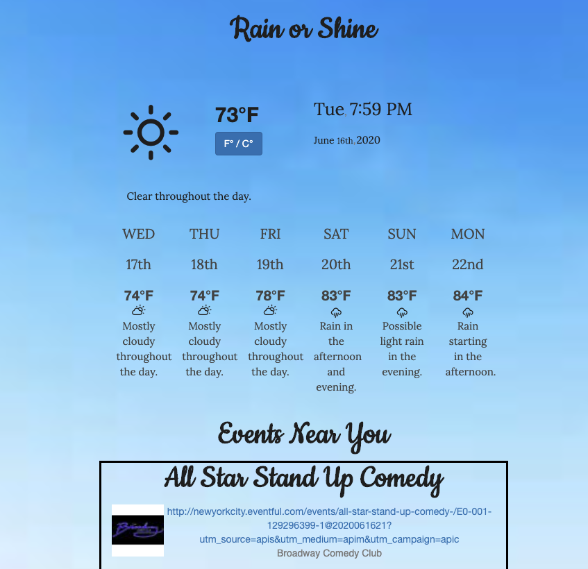

# Rain or Shine (Project 1)

https://bruspdoee.github.io/Rain-or-Shine/

<strong>Desktop</strong>
 

 
 
For our APIs, we utilized three.

The weather API, Dark Sky, shows the current conditions outside as well as well as the weather over a six-day period. We also gave users the option to convert the temperature from Celsius to Fahrenheit, depending on who’s utilizing the app.

The event API, Eventful, which we altered to only focus on the New York City metropolitan area within 25 miles from the borough of Manhattan.

As for the location API, we used Geolocation & Google.

<b>The Process – Challenges and Successes</b>

We found success in not only finding APIs that were essential to the app, but we also found a strong benefit in building a button that would alternate between the two measurements of temperature. The most important factor was finding APIs that carried out what we needed them to do.

The major challenge was trying to connect all three APIs to do what we wanted them to do: show outdoor events on sunny days and show indoor events on rainy days. Since these three APIs couldn’t be any different, it was a bit of an effort to get them to work off one another.

Once that was figured out, we then shifted our focus into the layout, giving the building continued success.
 
 
<a href="https://docs.google.com/presentation/d/1xfNxl-PiR1lALUKr-cThuAF_Pw-pQxHavgxNKxym_5I/edit#slide=id.g71e2b043e1_2_0" target="_blank">Rain or Shine Presentation</a>
